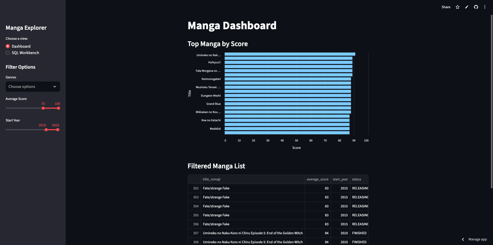

# 📊 AniList Manga Pipeline




This project builds a lightweight data pipeline to fetch, transform, and explore top manga data using Python, SQLite, and Streamlit.

---

Try the SQL-powered manga explorer live in your browser — no setup needed!

---

## 🔧 Features

- 🗃️ Ingest top manga data from external APIs  
- 🧼 Clean and transform the data  
- 💾 Store it in a local SQLite database  
- 🧪 Query the database using a **Streamlit SQL Workbench**

> **Note:** Dashboard visualizations are coming soon!

---

## 🗂️ Project Structure

manga_data_pipeline/
├── data/ # Raw input data (e.g. CSV)
├── db/ # SQLite database
├── etl/ # Scripts to fetch and process manga data
├── streamlit_app/ # Streamlit interface
│ └── app.py
├── .venv/ # Virtual environment (not tracked)
├── requirements.txt
└── README.md

---

## 🚀 How to Run Locally

1. **Clone the repo**
```bash
git clone https://github.com/duartedasilva172/anilist_manga_pipeline.git
cd anilist_manga_pipeline

python -m venv .venv
source .venv/bin/activate      # macOS & Linux
# OR
.\.venv\Scripts\activate       # Windows

pip install -r requirements.txt

streamlit run streamlit_app/app.py
```

🧠 Tech Stack

Python 3.9

Streamlit – interactive UI

Pandas – data transformation

SQLite3 – lightweight data storage

📌 To Do

📈 Build dashboard with key insights (scores, rankings, genres)

🔍 Add filter and search options in UI

🧪 Write tests for ETL and database logic

📬 Contact

Made by @duartedasilva172

Feel free to fork, clone, or reach out for collaboration!
